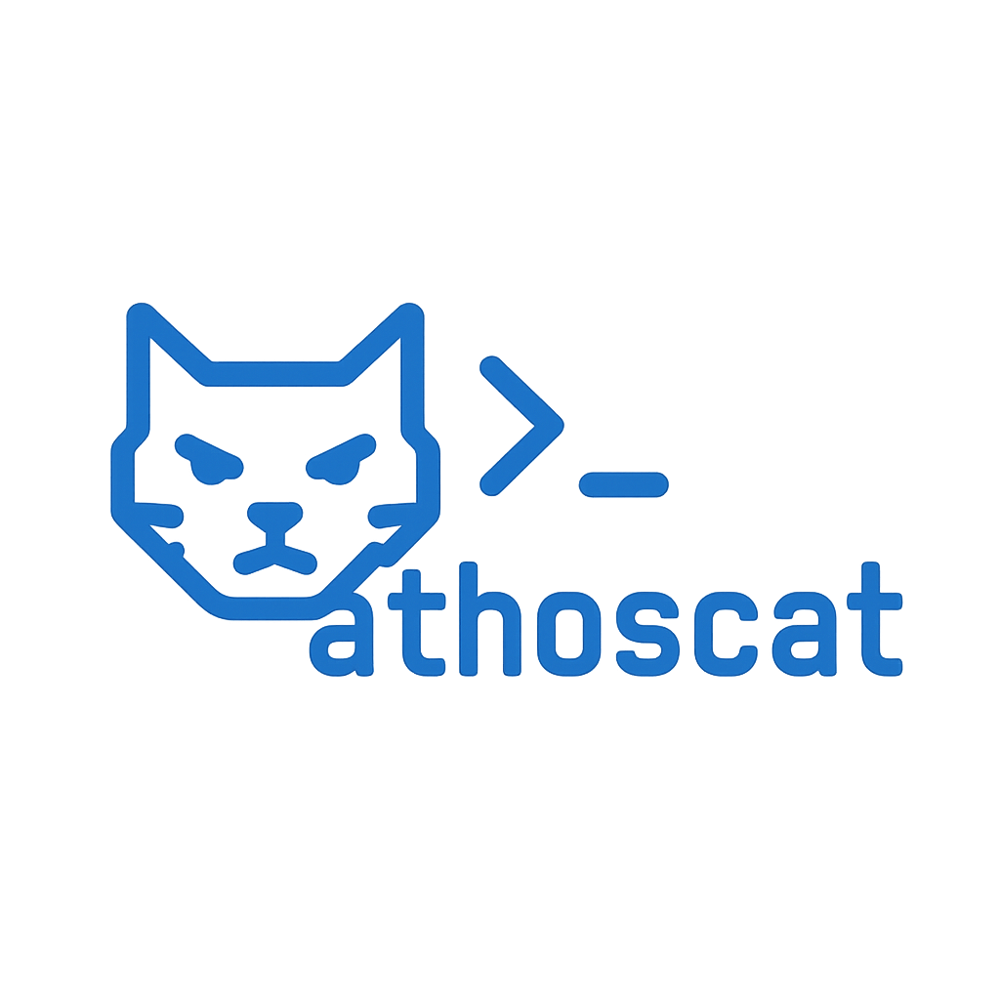

## Overview

AthosCat is a lightweight network tool inspired by Netcat, designed for establishing TCP and UDP connections using IPv4 or IPv6. It supports two main modes:

- **Client mode**: Connects to remote servers to send and receive data.
- **Listener mode**: Opens a local port to accept incoming connections or datagrams.

## Current State

- **Client Mode**  
  - Supports TCP and UDP protocols.  
  - Can connect to IPv4 and IPv6 addresses.  
  - Uses `select()` to handle simultaneous input/output from stdin and network socket.  
  - Allows sending data interactively to remote servers.  
  - Supports `-e <program>` to execute a command (e.g. interactive shell) after connection.

- **Listener Mode**  
  - Supports TCP and UDP protocols.  
  - Binds to a local port and listens for incoming connections (TCP) or datagrams (UDP).  
  - For TCP, accepts a single client and prints received data to stdout.  
  - For UDP, receives datagrams with a configurable timeout.  
  - With `-e <program>`, executes the program with stdin/out redirected to the socket.  
  - Requires confirmation (`-y`) to avoid accidental use.

## Usage Examples

### Run the listener (server) on port 8080 TCP:

```bash
./athoscat --listen -p 8080 -v
```

### Run the listener and execute a shell after client connects:

```bash
sudo ./athoscat --listen -p 8080 -e /bin/sh -y
```

### Connect with the client to the listener:

```bash
./athoscat --client -h 127.0.0.1 -p 8080 -v
```

### Connect and spawn a program after connection (e.g. /bin/sh):

```bash
sudo ./athoscat --client -h 127.0.0.1 -p 8080 -e /bin/sh
```

> ⚠️ The `-e` option requires root privileges and should be used responsibly.  
> ⚠️ In `--listen` mode, use `-y` to confirm execution automatically, or you will be prompted to type `y`.

---
